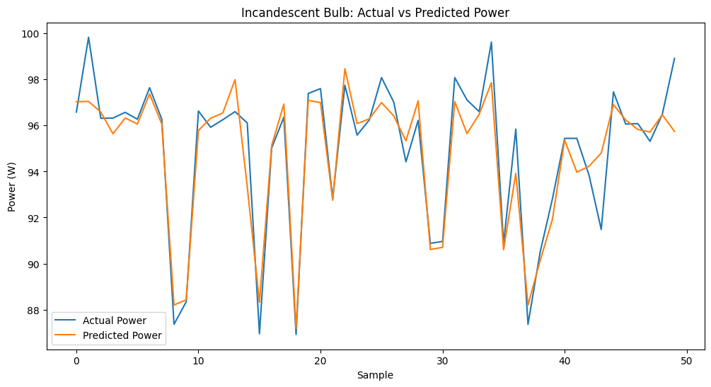
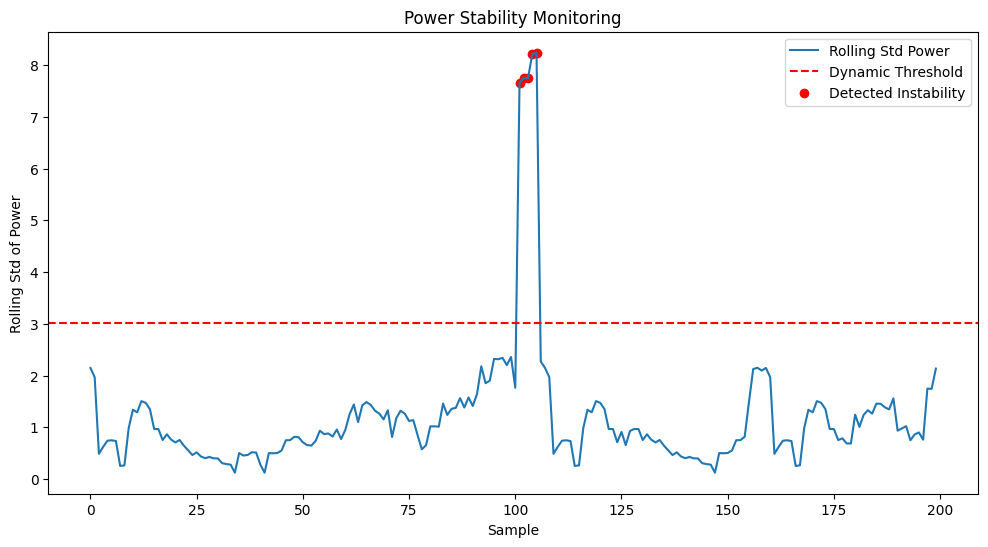
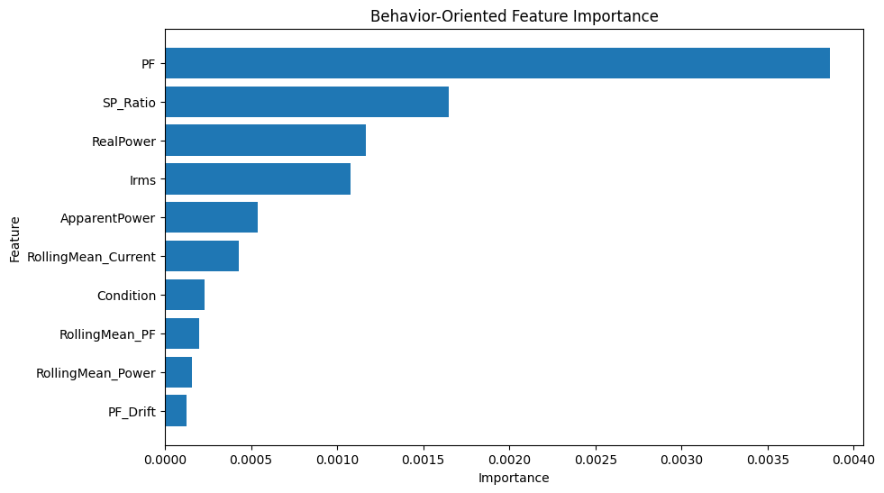
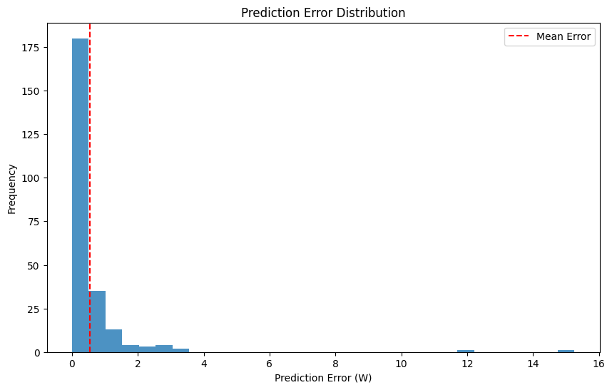

# Predictive Energy Intelligence System

An AI-powered real-time electrical energy monitoring and predictive analytics system using ESP32, ADS1115, and XGBoost for appliance behavior analysis, instability detection, and future power prediction.

---

## Overview

This project combines embedded sensing, real-time electrical parameter computation, and machine learning–based predictive analytics to create an intelligent energy monitoring framework capable of:

- Real-time RMS voltage and current monitoring
- Real power and power factor calculation
- Future power consumption prediction
- Appliance health analysis
- Electrical instability detection
- Predictive fault monitoring

Unlike traditional energy meters that rely on simplified assumptions, this system performs instantaneous waveform sampling for accurate analysis of resistive, inductive, and non-linear electrical loads.

---

## Key Features

- Real-time monitoring of:
  - RMS Voltage (Vrms)
  - RMS Current (Irms)
  - Real Power
  - Apparent Power
  - Power Factor (PF)

- XGBoost-based future power prediction

- Rolling statistical analysis for:
  - Stability monitoring
  - Fluctuation detection
  - Drift analysis

- Appliance health classification:
  - Healthy
  - Mild Risk
  - Moderate Risk
  - Severe Risk

- Intelligent diagnostic and maintenance recommendation system

- Supports:
  - Resistive Loads
  - Inductive Loads
  - Non-linear Loads

---

## System Architecture

```text
ESP32 + ADS1115
        ↓
Voltage & Current Sampling
        ↓
Signal Processing
        ↓
Feature Engineering
        ↓
XGBoost Regression Model
        ↓
Health Analysis & Prediction
        ↓
Diagnostic Output
```

---

## Hardware Components

| Component | Purpose |
|---|---|
| ESP32 | Real-time processing and communication |
| ADS1115 | 16-bit high-resolution ADC |
| SCT-013 | Non-invasive current sensing |
| ZMPT101B | AC voltage sensing |
| Relay Module | Protection and load control |

---

## Machine Learning Pipeline

### Model Used
- XGBoost Regressor

### Input Features
- RMS Voltage
- RMS Current
- Real Power
- Apparent Power
- Power Factor
- SP Ratio
- Rolling Mean
- Rolling Standard Deviation
- Current Drift
- PF Drift

### ML Objectives
- Future power prediction
- Appliance behavior analysis
- Stability monitoring
- Predictive diagnostics

---

## Electrical Loads Tested

| Load Type | Appliance |
|---|---|
| Resistive | Incandescent Bulb |
| Resistive | Heating Coil |
| Inductive | Table Fan |
| Non-linear | LED Bulb |

---

# Results

## Future Power Prediction

The XGBoost model successfully predicts future appliance power consumption from live sequential electrical data with low prediction error and strong temporal consistency.



---

## Real-Time Stability Monitoring

Rolling statistical analysis enables detection of unstable electrical behavior and sudden fluctuations.



---

## Feature Contribution Analysis

Power Factor, SP Ratio, and Real Power emerged as dominant predictive features for appliance behavior analysis.



---

## Prediction Error Distribution

Most prediction errors remain concentrated near zero, indicating strong regression stability and reliable inference performance.



---

## Live Monitoring Output

Real-time electrical monitoring and appliance diagnostics generated using live ESP32 sensor data.


---

## Technologies Used

### Embedded System
- ESP32
- ADS1115 ADC
- SCT-013 Current Sensor
- ZMPT101B Voltage Sensor

### Machine Learning & Data Analysis
- Python
- XGBoost
- Scikit-learn
- Pandas
- NumPy
- Matplotlib

---

## Project Highlights

- Instantaneous AC waveform sampling
- Real-time power computation
- Predictive energy intelligence
- Drift-based appliance analysis
- Stability and anomaly monitoring
- Intelligent diagnostic framework
- Low-cost scalable implementation

---

## Future Improvements

- Simultaneous ADC sampling for improved phase accuracy
- Harmonic analysis for power quality monitoring
- Cloud dashboard integration
- Three-phase system support
- Advanced predictive maintenance models

---

## Repository Structure

```text
plots/        → Visualization and ML result graphs
results/      → Live monitoring outputs
.ipynb file   → Model training and experimentation
.py file      → Real-time inference pipeline
.pkl model    → Trained XGBoost model
```

---

## Author

Abhradeep Kayal  
Electrical Engineering  
IIEST Shibpur

---

## Related Repositories

- Overload Detection Model (RF Classifier)
- Embedded System Repository (ESP32 + Circuit Design)
- Flutter Application Repository (Real-time Mobile Monitoring UI)
